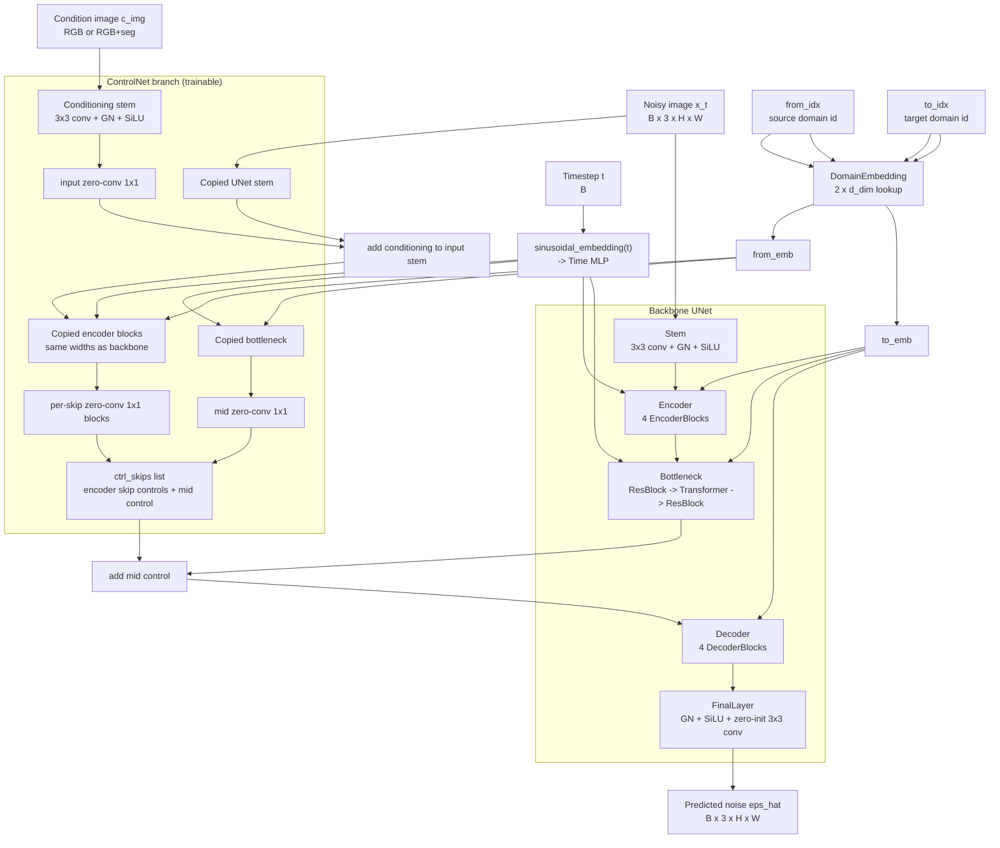
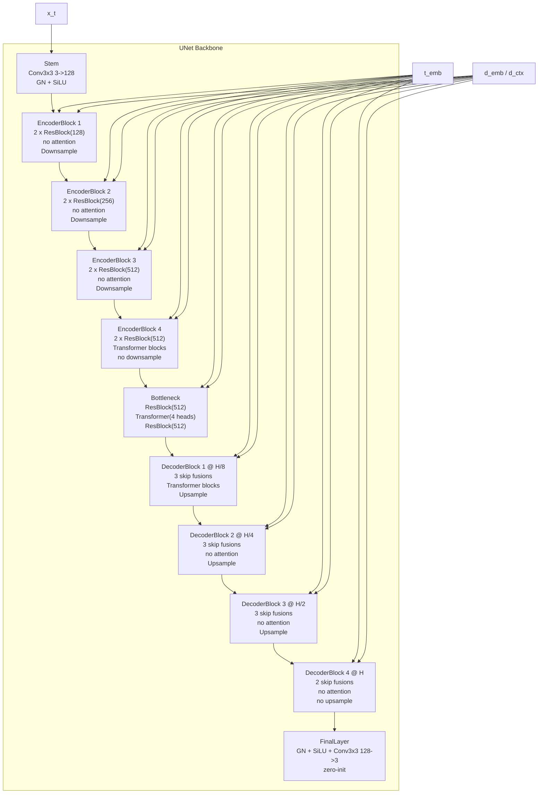
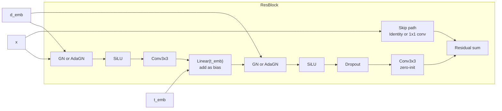
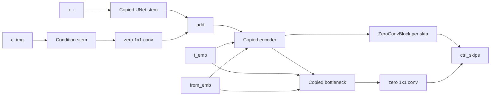
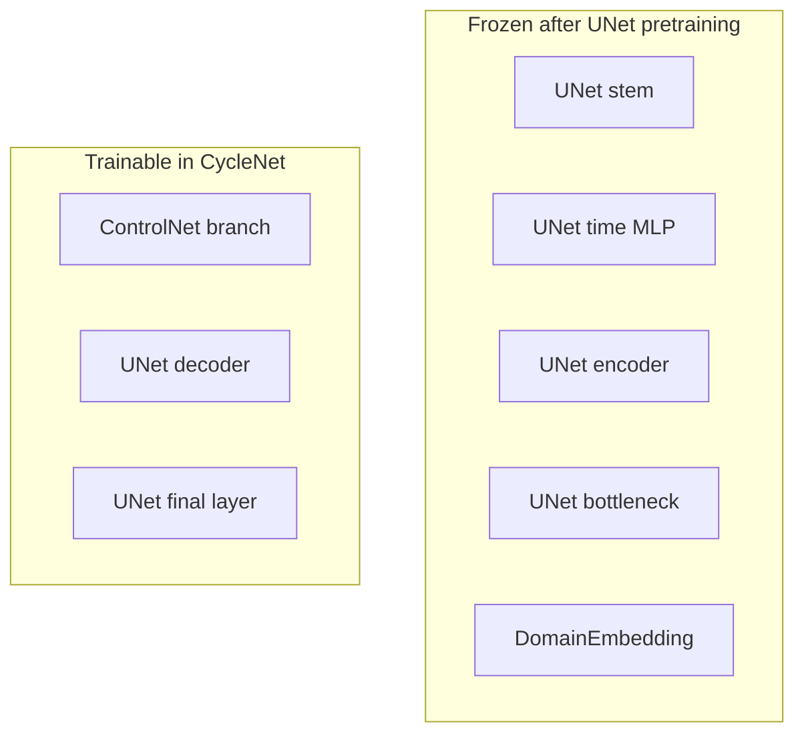
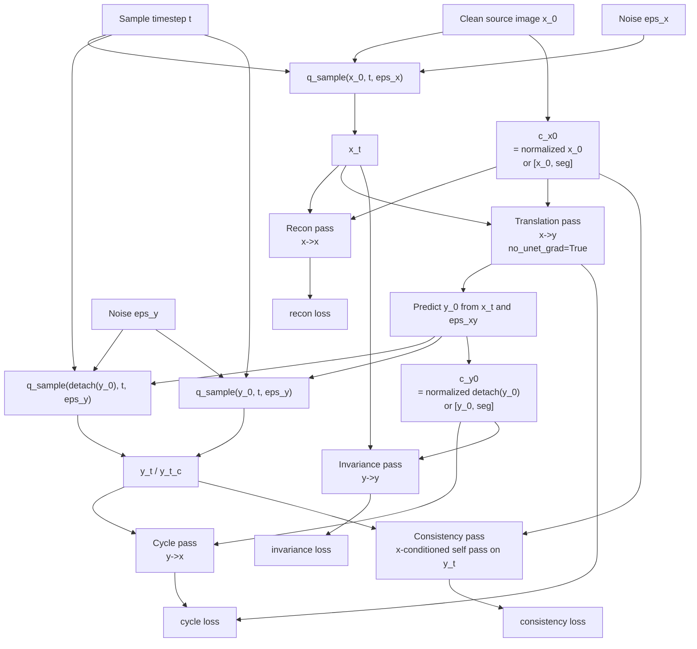

# CycleNet Architecture

This document summarizes the architecture implemented in `src/cyclenet`, not the original reference code under `CycleNet/`.

## Configured Backbone Shape

From [`configs/unet/train_unet.yaml`](/Users/loganbrenningmeyer/Documents/GitHub/pixel-cyclenet/configs/unet/train_unet.yaml):

- `in_ch = 3`
- `base_ch = 128`
- `t_dim = 512`
- `d_dim = 128`
- `ch_mults = [1, 2, 4, 4]`
- `num_res_blocks = 2`
- `enc_heads = [0, 0, 0, 4]`
- `mid_heads = 4`

This gives the main spatial/channel path:

- `H x W x 3`
- `H x W x 128`
- `H/2 x W/2 x 128`
- `H/4 x W/4 x 256`
- `H/8 x W/8 x 512`
- `H/8 x W/8 x 512` bottleneck
- decoder mirrors back to `H x W x 128`
- final `3`-channel epsilon prediction

## 1. Model Topology

## 2. Backbone Internals

## 3. Per-Block Composition

Notes:

- `AdaGN` is GroupNorm plus FiLM-style scale/shift from the domain embedding.
- `conv2` in each `ResBlock` is zero-initialized.
- Attention blocks are also zero-initialized on the output projection.

## 4. ControlNet Injection Pattern

The backbone decoder consumes these controls by summing them into:

- the bottleneck feature before decoding
- every backbone skip tensor before concatenation in each `DecoderBlock`

## 5. Trainable vs Frozen During CycleNet Training

## 6. Cycle Training Flow

## 7. Practical Summary

- Your `CycleNet` is not a latent-diffusion model. It operates directly in pixel space and predicts image-space diffusion noise.
- `ControlNet` is initialized from a pretrained UNet encoder/bottleneck, then trained to inject source-domain structural and low-level conditioning into a mostly frozen backbone.
- Domain translation is done by:
  - `from_emb` driving the ControlNet branch
  - `to_emb` driving the backbone branch
  - `c_img` providing image or image+seg conditioning
- During CycleNet finetuning, most representation learning capacity sits in:
  - ControlNet zero-conv-conditioned branch
  - backbone decoder
  - backbone final output layer
