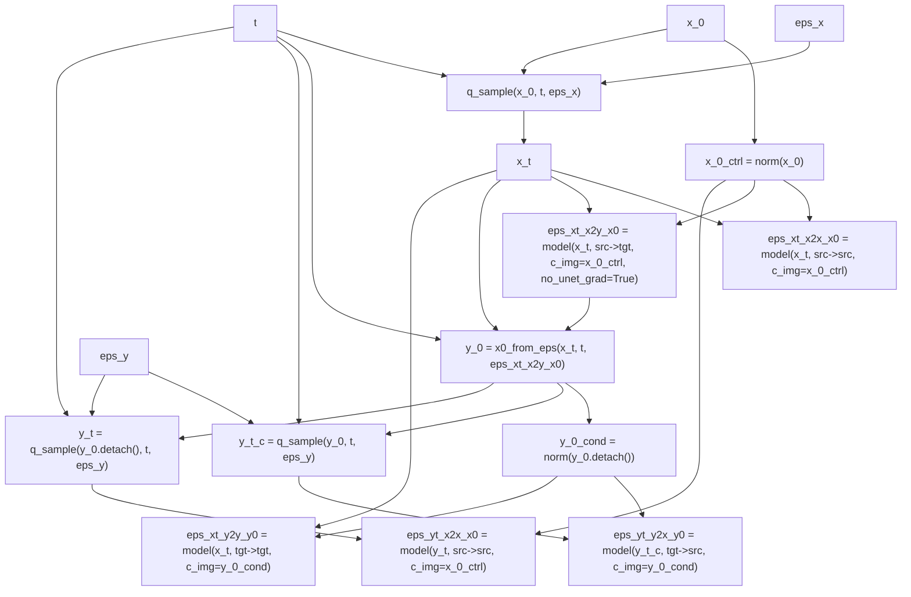
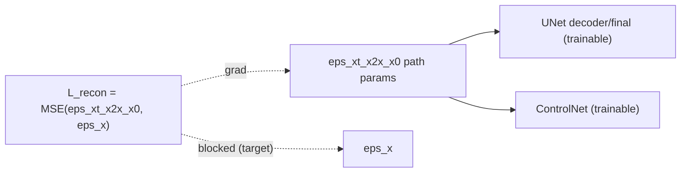
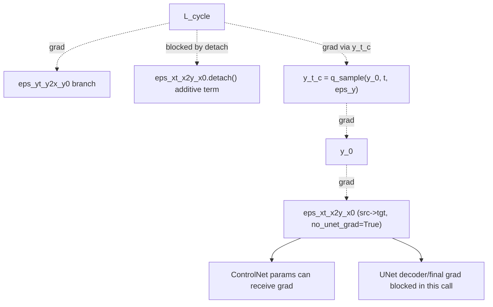
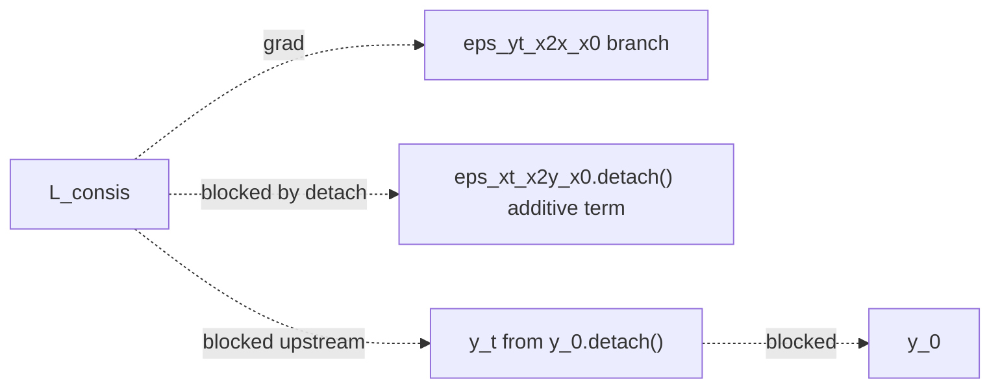
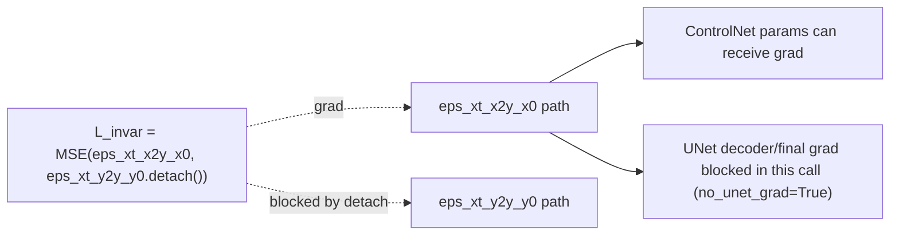

# CycleNet Loss Gradient Flow (`src/cyclenet/diffusion/losses.py`)

This document explains what each loss in `cyclenet_loss(...)` is optimizing, how gradients flow, and why specific design choices are used (`x2x` vs `x2y`, `x_0` vs `y_0` conditioning, `detach()`, and `no_unet_grad=True`).

## Quick Context

Losses defined in `src/cyclenet/diffusion/losses.py`:

- `recon_loss`: `MSE(eps_xt_x2x_x0, eps_x)`
- `cycle_loss`: `MSE(eps_xt_x2y_x0.detach() + eps_yt_y2x_y0, eps_x + eps_y)`
- `consis_loss`: `MSE(eps_xt_x2y_x0.detach() + eps_yt_x2x_x0, eps_x + eps_y)`
- `invar_loss`: `MSE(eps_xt_x2y_x0, eps_xt_y2y_y0.detach())`

Weighted sum is built in `src/cyclenet/training/cyclenet_trainer.py`.

## Legend And Notation

- `x_0`: clean input image (either sim or real, depending on sample).
- `x_t`: noised sample from `x_0` at timestep `t`.
- `eps_x`, `eps_y`: Gaussian noise targets.
- `x_0_ctrl`: normalized `x_0` in `[0,1]`, used as `c_img`.
- `eps_xt_x2x_x0`: noise prediction for `x_t` with `from=src`, `to=src`, conditioned by `x_0_ctrl`.
- `eps_xt_x2y_x0`: noise prediction for `x_t` with `from=src`, `to=tgt`, conditioned by `x_0_ctrl`.
- `y_0`: pseudo target clean image recovered from `x_t` and `eps_xt_x2y_x0`.
- `y_0_cond`: detached and normalized `y_0` in `[0,1]`, used as conditioning image.
- `y_t`: noised version of `y_0.detach()`.
- `y_t_c`: noised version of non-detached `y_0`.
- `eps_yt_y2x_y0`: prediction on `y_t_c` with `from=tgt`, `to=src`, conditioned by `y_0_cond`.
- `eps_yt_x2x_x0`: prediction on `y_t` with `from=src`, `to=src`, conditioned by `x_0_ctrl`.
- `eps_xt_y2y_y0`: prediction on `x_t` with `from=tgt`, `to=tgt`, conditioned by `y_0_cond`.

Gradient notation in diagrams:

- Solid arrows: forward data dependency.
- Dashed arrows with `grad`: backward flow.
- Dashed arrows with `blocked`: explicitly blocked by `detach()` or no-grad behavior.

## Parameter Groups That Can Receive Gradients

From `src/cyclenet/models/cyclenet.py`:

- Always frozen: backbone stem, `t_mlp`, encoder, mid, and domain embedding.
- Usually trainable: backbone decoder + final layer, ControlNet.
- For `no_unet_grad=True` calls: backbone decoder + final are temporarily set non-trainable for that forward path.

So gradient analysis below effectively means:

- "UNet trainable" = decoder/final only.
- "Control trainable" = ControlNet path.

## Shared Forward Graph (All Losses)

---

## 1) Reconstruction Loss (`recon_loss`)

\[
\mathcal{L}_{recon} = \| \epsilon_{\theta}(x_t, x \rightarrow x, x_0) - \epsilon_x \|_2^2
\]

### High-level role

- Primary content/identity anchor.
- Trains the model to denoise while staying in the same domain (`x2x`), preserving geometry and structure.
- This is the strongest direct "do not drift far from source content" objective.

### Gradient flow

### Why `x2x` and `c_img=x_0_ctrl`?

- `x2x` makes a same-domain denoising target explicit, which tightly constrains content preservation.
- `c_img=x_0_ctrl` injects direct source-image structure into ControlNet conditioning.
- Together they make content retention robust, but can reduce aggressive style transfer if over-weighted.

---

## 2) Cycle Loss (`cycle_loss`)

\[
\mathcal{L}_{cycle} =
\| \epsilon_{x\rightarrow y}^{detach} + \epsilon_{y\rightarrow x}(y_t^c, \bar y_0) - (\epsilon_x + \epsilon_y) \|_2^2
\]

where `y_t_c` is built from non-detached `y_0`, and `y_0_cond = norm(y_0.detach())`.

### High-level role

- Enforces translation-cycle coherence: an `x->y` move followed by `y->x` should be noise-consistent.
- Encourages invertible/consistent cross-domain mapping without paired supervision.
- More about coherent translation dynamics than direct texture realism.

### Gradient flow details (important)

### Why this design?

- `eps_xt_x2y_x0.detach()` in the residual prevents an unstable direct shortcut where the same term both defines and chases the target residual.
- Keeping `y_t_c` non-detached still allows controlled gradient from cycle consistency back into the `x->y` prediction.
- `no_unet_grad=True` on the `x->y` call focuses this branch's update pressure away from UNet decoder/final and onto controllable adapter behavior (ControlNet), reducing catastrophic drift of pretrained denoising behavior.
- `y_0_cond` detached prevents second-pass conditioning feedback loops through `c_img`.

---

## 3) Consistency Loss (`consis_loss`)

\[
\mathcal{L}_{consis} =
\| \epsilon_{x\rightarrow y}^{detach} + \epsilon_{x\rightarrow x}(y_t, x_0) - (\epsilon_x + \epsilon_y) \|_2^2
\]

with `y_t = q_sample(y_0.detach(), t, eps_y)`.

### High-level role

- Regularizes denoising consistency under translated-noise context while anchoring to the source-domain (`x2x`) prediction path.
- Primarily stabilizes structure/content behavior under perturbation.

### Gradient flow

### Why `y_t` from `y_0.detach()`?

- Prevents this regularizer from backpropagating into pseudo-target construction.
- Keeps consistency loss focused on stabilizing denoising behavior rather than reshaping the translation branch.
- This makes it a strong stabilizer, but also contributes to conservative translation if weighted too heavily relative to style-driving terms.

---

## 4) Invariance Loss (`invar_loss`)

\[
\mathcal{L}_{invar} =
\| \epsilon_{x\rightarrow y}(x_t, x_0) - \epsilon_{y\rightarrow y}(x_t, \bar y_0)^{detach} \|_2^2
\]

### High-level role

- Encourages invariance of target-domain denoising behavior across conditioning variants.
- Acts as a target-side regularizer: translated prediction should align with a target-conditioned self prediction.

### Gradient flow

### Why detach the `y2y` side?

- Treats `eps_xt_y2y_y0` as a stable reference target for this term.
- Avoids both branches moving simultaneously in lockstep (which can weaken the constraint).
- Because `eps_xt_x2y_x0` came from the no-UNet-grad call, this mostly shapes ControlNet-side translation behavior.

---

## Why Use `x2x` vs `x2y`?

- `x2x`:
  - Identity/same-domain denoising anchor.
  - Strong content/structure preservation signal.
  - Provides a robust "source-consistent" baseline used directly in `recon` and `consis`, and as CFG uncond branch at sampling.

- `x2y`:
  - Cross-domain translation direction (style/artifact transfer pathway).
  - Used to construct pseudo-target `y_0` for cycle-style constraints.
  - In this implementation, direct gradients to this branch are often restricted by detach/no-UNet-grad design, emphasizing stable adaptation over aggressive shift.

## Why Condition With `x_0` vs `y_0` vs `y_0_cond`?

- `x_0_ctrl` (`norm(x_0)`):
  - Direct source structural context.
  - Reinforces spatial content fidelity during denoising.

- `y_0`:
  - Pseudo target clean sample inferred from `x->y` prediction.
  - Enables unpaired cycle/consistency construction.

- `y_0_cond` (`norm(y_0.detach())`):
  - Uses pseudo-target appearance as conditioning context while intentionally blocking gradients through that condition path.
  - Helps avoid unstable recursive self-conditioning updates.

## Behavioral Interpretation (Content vs Style Pull)

- Content-preserving pressure is strong because:
  - `recon` is an explicit `x2x` identity objective.
  - `consis` also updates an `x2x` branch and blocks upstream pseudo-target gradients.
  - Conditioning frequently uses source-derived `x_0_ctrl`.

- Style/domain-shift pressure is more indirect because:
  - Key terms include detached components.
  - `x2y` calls used for pseudo-target construction are made with `no_unet_grad=True`, limiting which parameters absorb that signal.

This combination typically yields stable geometry/content and can require stronger inference steering (`CFG`, noise strength) to amplify visible target-domain artifacts at later training stages.

## Summary Table

| Loss | Main intention | Main gradient recipients | Explicitly blocked paths | Typical effect |
|---|---|---|---|---|
| `recon` | Same-domain denoising fidelity (`x2x`) | UNet decoder/final + ControlNet on `x2x` pass | `eps_x` target | Strong content/structure preservation |
| `cycle` | Cross-domain cycle coherence | `y2x` pass, plus indirect path to `x2y` via `y_t_c -> y_0` (Control-heavy due to no-UNet-grad) | Direct `x2y` additive term (`detach`), `y_0_cond` path | Stabilizes bidirectional consistency |
| `consis` | Consistency regularization with source anchor | `x2x` on `y_t` pass | `x2y` additive term, `y_0` upstream via `y_0.detach()` | Stabilizes denoising, reinforces conservative behavior |
| `invar` | Target-style invariance under conditioning shift | `x2y` pass (Control-heavy due to no-UNet-grad) | `y2y` reference side (`detach`) | Regularizes translation branch without moving reference |

